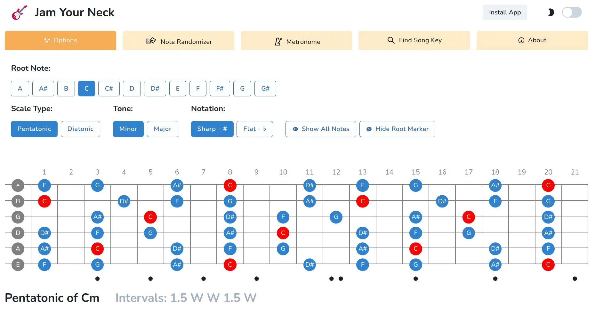
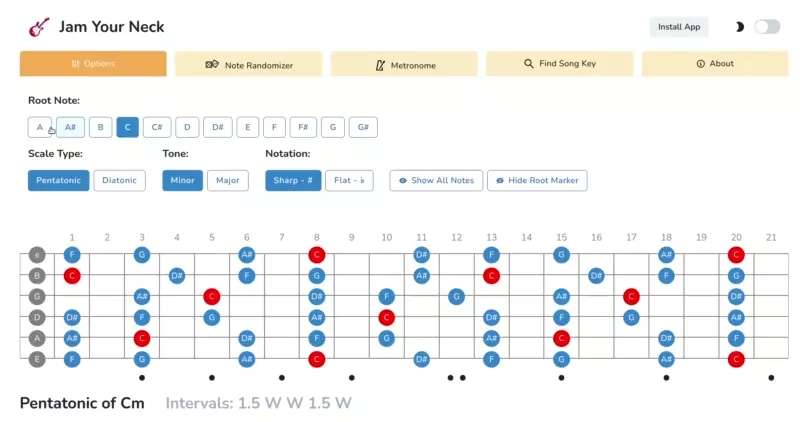

# Jam-Your-Neck

An app to learn the guitar scales while having fun jamming on track
Try it online: [Jam Your Neck](https://jamyourneck.netlify.app/)
## Features

- Generate any scale by selecting a key (root note), a type (pentatonic / diatonic) and a tone (minor / major),
- Display the intervals,
- Note randomizer, which can generate notes from the scale you've just generated or all the notes,
- Metronome to practice hitting the correct notes on a beat you choose,
- Search for your favorite song and fetch its key and BPM. A link will open the song on YouTube, so you can play over it,
- The app is installable on any device (PWA). This means you will have an icon just like a regular app and be able to access it offline. It will also display in a window that feels like a native app.
- Dark mode

## Screenshot and GIF

## Why this app?
Hi, I'm Guillaume. I created this app because while playing on backing tracks from YouTube, I was tired of searching on Google for an image of the neck with the scale of the track I was playing over.

This app allows you to get the notes on the neck in a couple of clicks. It helped me save time and play more. I hope it can help other fellow guitarists as well. Have fun playing scales!

## Limitations
If you use the app on your smartphone, use it in landscape mode. The guitar neck can't be wrapped, I've done my best to make it useable down to 600px width, which should accommodate most nowadays phones.

When searching for a song, you might not always get the result you want. This is due to the API I use. Unfortunately, I can't sort the songs by popularity. If you want to find the key of a song, please use the link below to GetSongKey.

## Source Code
[GitHub](https://github.com/Poukame/Jam-Your-Neck)

Built using: 
- [React](https://github.com/facebook/react)
- [Chakra UI](https://github.com/chakra-ui/chakra-ui)
- [Vite](https://github.com/vitejs/vite) and  [VitePWA](https://github.com/antfu/vite-plugin-pwa)
- [Iconify](https://icon-sets.iconify.design/)

## Credits
This app is fetching the songs' data from [GetSongKey.com](https://getsongkey.com/) API . Thanks to them.